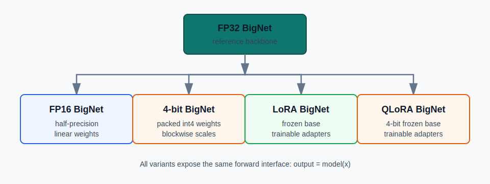
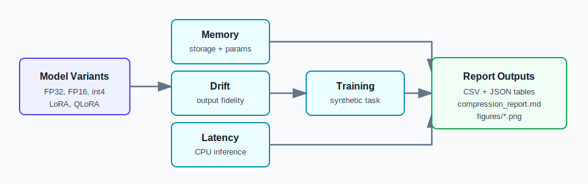

# TinyAdapt

TinyAdapt is a compact PyTorch project for comparing neural-network compression and parameter-efficient adaptation methods.

It implements:

- FP32 `BigNet` baseline
- FP16 inference model
- custom blockwise 4-bit weight-only quantization
- LoRA adapters
- QLoRA-style adapters over a frozen 4-bit base

The benchmark suite reports memory footprint, trainable parameter count, output drift, latency, and small downstream adaptation results.

## What This Project Does

TinyAdapt answers a practical systems question:

> How much memory and training cost can we save while keeping model behavior close to the full-precision baseline?

The project is intentionally small enough to run on CPU, but the pieces mirror techniques used in larger model-compression workflows.

## Methods Compared

| Method | Base weights | Trainable weights | Primary purpose |
| --- | --- | --- | --- |
| FP32 BigNet | float32 | all parameters | reference model |
| FP16 BigNet | float16 linear weights | none by default | lower storage inference |
| 4-bit BigNet | packed int4 weights + scales | bias and norms only | aggressive weight compression |
| LoRA BigNet | frozen float16 base | low-rank adapters | cheap fine-tuning |
| QLoRA BigNet | frozen 4-bit base | low-rank adapters | compressed PEFT |

## Installation

```bash
pip install -e .
```

For development:

```bash
pip install -e ".[dev,demo]"
```

To generate charts in the report:

```bash
pip install -e ".[charts]"
```

## Run Benchmarks

```bash
python scripts/run_all_benchmarks.py
```

The script writes JSON and CSV outputs under `reports/`.

## Train Adapters

```bash
python scripts/train_lora.py --epochs 5 --rank 8
python scripts/train_qlora.py --epochs 5 --rank 8
```

The default task is a reproducible synthetic clustered-vector classification problem, so the project runs without downloads.

## Generate Report

```bash
python scripts/export_report.py
```

This reads benchmark outputs from `reports/benchmark_results.json` and writes `reports/compression_report.md`.
If `matplotlib` is installed, it also writes figures under `reports/figures/`.

## Reports And Figures

The full generated report lives at [reports/compression_report.md](reports/compression_report.md). The project also includes a pair of stable overview figures:





After running the benchmark and report scripts, the README can also surface these generated result figures:

- [Memory vs. accuracy](reports/figures/memory_vs_accuracy.png)
- [Latency vs. accuracy](reports/figures/latency_vs_accuracy.png)
- [Output drift by model](reports/figures/output_drift_by_model.png)
- [Trainable parameters vs. accuracy](reports/figures/trainable_params_vs_accuracy.png)

## View Demo

```bash
streamlit run demo/app.py
```

The demo lets you pick a model variant, generate inputs, and compare latency, output drift, memory footprint, and trainable parameters.

## Project Structure

```text
tinyadapt/
  models/          model variants
  quantization/    blockwise 4-bit packing
  training/        synthetic task and adapter training
  benchmarks/      memory, drift, latency, training benchmarks
  utils/           seeding, checkpoint, and stats helpers
scripts/           runnable benchmark and training entry points
tests/             focused unit tests
reports/           generated benchmark outputs and report
demo/              optional Streamlit app
```

## Key Takeaways

- FP16 usually cuts linear-weight storage nearly in half with small output drift.
- 4-bit quantization gives much larger storage savings, at the cost of dequantization overhead and larger drift.
- LoRA and QLoRA fine-tune only adapter matrices while keeping the backbone frozen.
- QLoRA combines the storage benefit of 4-bit base weights with the training efficiency of LoRA.
