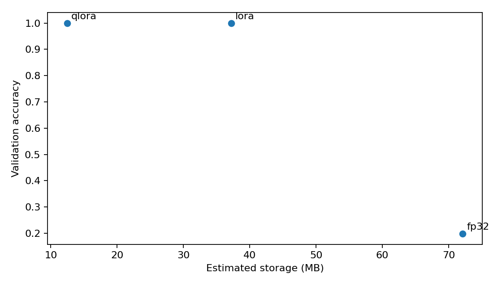
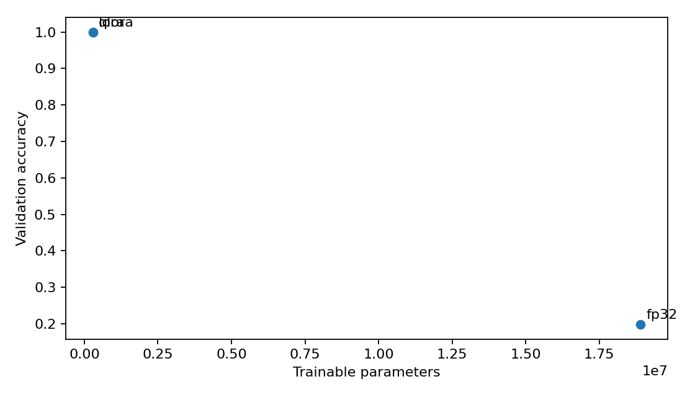
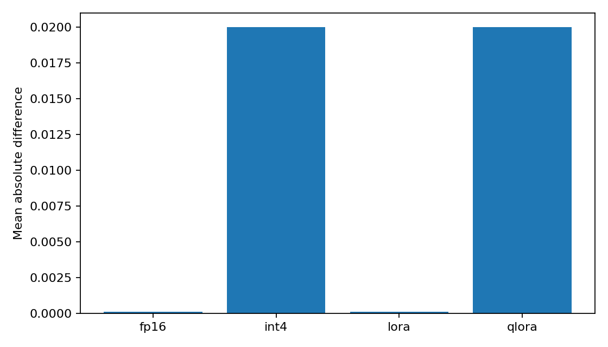
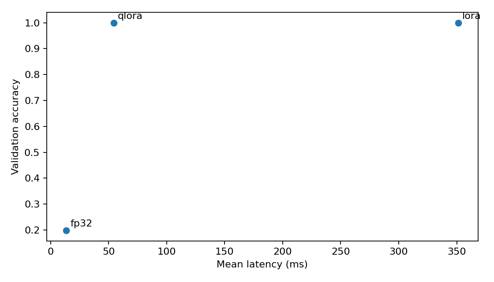

# TinyAdapt Compression Report

## Introduction

TinyAdapt compares a full-precision residual MLP against FP16 inference, blockwise 4-bit quantization, LoRA, and QLoRA-style adaptation.

## Motivation

The goal is to measure the practical tradeoff between model storage, output fidelity, inference speed, and downstream adaptation cost.

## Baseline Model

The shared backbone is `BigNet`, a residual MLP over 1024-dimensional vectors. All variants expose the same `model(x)` interface.

## Results

### Memory

| Model | Total Parameters | Trainable Parameters | Storage | Reduction vs FP32 |
| --- | --- | --- | --- | --- |
| fp32 | 18,903,040 | 18,903,040 | 72.11 MB | 0.0% |
| fp16 | 18,903,040 | 0 | 36.07 MB | 50.0% |
| int4 | 18,903,040 | 0 | 11.36 MB | 84.2% |
| lora | 19,197,952 | 294,912 | 37.20 MB | 48.4% |
| qlora | 19,197,952 | 294,912 | 12.48 MB | 82.7% |

### Output Drift

| Model | Mean Abs Diff | Max Abs Diff | Relative Error |
| --- | --- | --- | --- |
| fp16 | 0.000099 | 0.000500 | 0.000124 |
| int4 | 0.019977 | 0.097084 | 0.024789 |
| lora | 0.000099 | 0.000500 | 0.000124 |
| qlora | 0.019977 | 0.097084 | 0.024789 |

### Downstream Adaptation

| Model | Trainable Params | Validation Accuracy | Final Loss | Seconds/Epoch |
| --- | --- | --- | --- | --- |
| fp32 | 18,907,140 | 0.198 | 1.5767 | 0.491 |
| lora | 299,012 | 1.000 | 0.0525 | 20.787 |
| qlora | 299,012 | 1.000 | 0.0525 | 0.468 |

### Figures

## Tradeoff Analysis

FP16 is the simplest storage reduction method. It keeps the architecture unchanged and normally has the smallest output drift. The 4-bit model stores far fewer bytes, but reconstructs weights during the forward pass. LoRA reduces fine-tuning cost by training only low-rank adapters. QLoRA combines a compressed frozen base with trainable adapters.

## Limitations

This project uses a compact residual MLP and an offline synthetic classification task. Larger pretrained transformer backbones, calibration data, and GPU-specific kernels would be useful next steps.

## Future Work

- Add GPU latency and memory benchmarks.
- Compare multiple LoRA ranks and quantization block sizes.
- Add ONNX export and a pretrained transformer variant.
